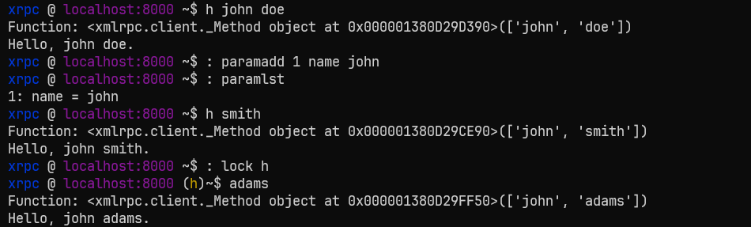

# XRPC - XML Remote Procedure Call
A wrapper script for the xmlrpc.client python module providing command-line like interaction with xml rpc servers. Includes built in script commands to to tweak script behaviour and the ability to execute os commands.

## Gallery


## Structure
- `libs`: The help module and discovery (bruteforcing) module.
- `sample`: Sample XML RPC server for testing.

## Usage
To start xrpc run the following command:
```
python3 xrpc.py -s http://127.0.0.1:8000 [-dbg]
```

**Options:**
- **`-s`**: The url of the XRPC server to make calls to.
- **`-dbg`**: Output stack trace for debugging the script.


Procedure calls are made normally, that is the name of the procedure followed by it's parameters (space separated). But to run script and system commands <br>
- `: `: Colon-space, precedes commands that are difined within the script, like `help` and `join`.
- `! `: Exclamation-space, precedes system commands to (linux, windows, etc.).

## Examples
**list script commands**
```
: help
```
```
paramlst  - List all fixed parameters set.
paramadd  - Set a global parameter for procedure calls
paramdel  - Paremter to remove from set of fixed parameters.
paramrst  - Clear all global parameter or a specific parameter
lock      - Useful if you don't want to specify the function to call, all the time
unlock    - Clear the locked call
join      - Treat input as one string (ignore spaces), usefule for locked calls that requre long strings as parameters
split     - Undo the effect of 'join'
prefix    - String to add as a prefix to subsequent rpc calls. Useful for wordpress ('wp.') xml rpc calls.
suffix    - String to add as a suffix to subsequent rpc calls.
help      - Show help.
```

**get help for specific command**
```
: help paramadd
```
```
Set a global parameter for procedure calls

Usage:
        paramadd <number> <name> <value>
```

**add and list fixed parameters**
```
: paramadd 2 code 9952
```
```
: paramlst
```
```
2: code = 9952
```

**run os command**
```
! python --version
```
```
Python 3.11.9
```

**make procudure call**
```
xrpc @ localhost:8000 ~$ h john doe
```
```
Function: <xmlrpc.client._Method object at 0x000001EDFB89D150>(['john', 'doe'])
Hello, john doe.
```
